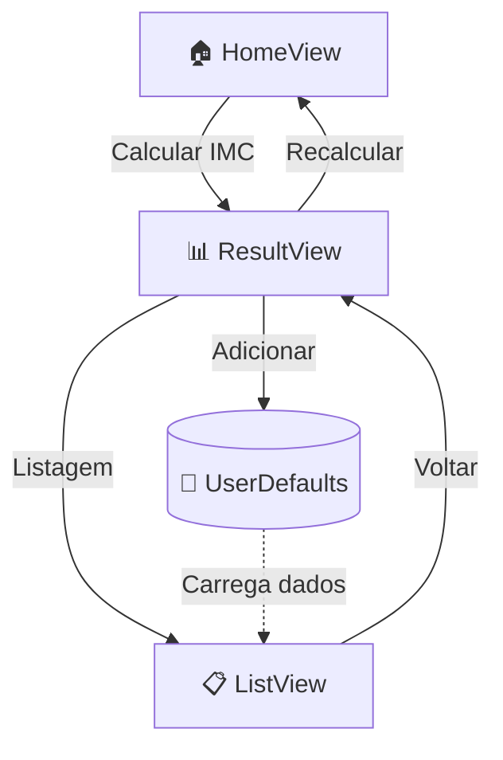

<div align="center">

# 📱 Calculadora de IMC

**Aplicativo iOS de cálculo de Índice de Massa Corporal — Aula 2**

[](https://swift.org)
[](https://developer.apple.com/xcode/swiftui/)
[](https://developer.apple.com/ios/)
[](https://github.com/UTFPR-Mobile26/IMC)

*Pós-Graduação em Programação para Dispositivos Móveis — UTFPR*

<br/>


</div>

---

## 📖 Sobre o projeto

Este repositório contém a **segunda aula prática** da disciplina de desenvolvimento mobile, focada na construção de interfaces nativas com **SwiftUI**. O app é uma **calculadora de IMC** (Índice de Massa Corporal) que permite ao usuário informar nome, sexo, altura e peso, visualizar o resultado com uma classificação visual e **salvar o histórico** de cálculos localmente no dispositivo.

O objetivo pedagógico é ensinar e consolidar os fundamentos de layout, estado, navegação e persistência em SwiftUI — habilidades essenciais para o desenvolvimento de apps iOS modernos.

---

## ✨ Funcionalidades

| Funcionalidade | Descrição |
|---|---|
| 🧮 **Cálculo de IMC** | Fórmula `peso / (altura²)` com altura em centímetros |
| 👤 **Personalização** | Campo de nome e seleção de sexo (Homem / Mulher) |
| 📏 **Controles de medida** | Steppers visuais (+/−) para altura (cm) e peso (kg) |
| 🖼️ **Feedback visual** | Ilustrações que mudam conforme sexo e faixa de IMC |
| 📊 **Classificação** | Exibe categoria (Magreza, Peso ideal, Obesidade, etc.) |
| 💾 **Persistência local** | Salva cálculos com `@AppStorage` + `Codable` |
| 📋 **Listagem** | Histórico de IMCs com opção de exclusão por swipe |
| 🔄 **Recalcular** | Retorna à tela inicial limpando a pilha de navegação |

---

## 🗺️ Fluxo de navegação



### Telas

#### 🏠 Home — Entrada de dados
Tela principal com campo de nome, seleção de gênero, controles de altura/peso e botão de cálculo. A ilustração central reage à escolha de sexo em tempo real.

#### 📊 Resultado — Classificação
Apresenta saudação personalizada, imagem representativa da faixa de IMC, valor numérico formatado e categoria textual. Oferece ações para salvar, consultar a lista ou recalcular.

#### 📋 Listagem — Histórico
Exibe todos os IMCs salvos com nome, sexo e valor. Quando vazia, mostra um **estado vazio** amigável. Suporta **exclusão** deslizando o item.

---

## 🧠 O que o app aborda

### Conceito de IMC

O **Índice de Massa Corporal** é uma medida internacional usada para avaliar se uma pessoa está dentro de uma faixa de peso considerada saudável para sua altura.

```
IMC = peso (kg) ÷ altura (m)²
```

No app, a altura é informada em **centímetros** e convertida internamente:

```swift
let imc = Double(weight) / (Double(height * height) / 10000)
```

### Classificação utilizada

| Faixa de IMC | Classificação | Ilustração |
|:---:|:---|:---:|
| < 16 | Magreza | 1 |
| 16 – 18,5 | Abaixo do peso | 2 |
| 18,5 – 25 | Peso ideal | 3 |
| 25 – 30 | Sobrepeso | 4 |
| ≥ 30 | Obesidade | 5 |

Cada faixa possui uma **ilustração exclusiva** por sexo (`Male1`–`Male5`, `Female1`–`Female5`), reforçando o feedback visual ao usuário.

---

## 🎓 Recursos do SwiftUI ensinados

Este projeto foi pensado como material de estudo. Abaixo estão os conceitos de SwiftUI aplicados, organizados por categoria.

### 🏗️ Estrutura e ciclo de vida

| Recurso | Onde é usado | O que ensina |
|---|---|---|
| `@main` + `App` | `IMCApp.swift` | Ponto de entrada de um app SwiftUI |
| `WindowGroup` | `IMCApp.swift` | Cena principal da janela do app |
| `#Preview` | Todas as Views | Pré-visualização em tempo real no Xcode |

### 📐 Layout e composição

| Recurso | Onde é usado | O que ensina |
|---|---|---|
| `VStack` / `HStack` | Todas as telas | Organização vertical e horizontal |
| `Spacer` | `HomeView` | Distribuição flexível de espaço |
| `Group` | `ListView` | Agrupamento condicional de views |
| Propriedades computadas (`var title: some View`) | `HomeView`, `ResultView` | Decomposição de views em partes reutilizáveis |
| `// MARK: -` | `HomeView` | Organização de código em seções |

### 🎨 Estilização

| Recurso | Onde é usado | O que ensina |
|---|---|---|
| `.font()` / `.fontWeight()` / `.fontDesign(.rounded)` | Várias telas | Tipografia e design de fonte |
| `.foregroundStyle()` | `ResultView`, `ListView` | Cores de texto e destaque |
| `.background()` + `.clipShape(RoundedRectangle)` | `HomeView`, `MeasureView` | Fundos com cantos arredondados |
| `.shadow()` | `HomeView`, `MeasureView` | Profundidade e elevação visual |
| `.opacity()` | `GenderButton` | Feedback visual de seleção |
| `Color.accentColor` | Várias telas | Cor de destaque do sistema |
| `.buttonStyle(.borderedProminent)` | `AppButton` | Estilo de botão preenchido |
| `.buttonStyle(.bordered)` | `ResultView` | Estilo de botão contornado |

### ⚡ Estado e dados

| Recurso | Onde é usado | O que ensina |
|---|---|---|
| `@State` | `ContentView`, `HomeView` | Estado local mutável da view |
| `@Binding` | `MeasureView`, `ResultView` | Passagem bidirecional de estado entre views |
| `@AppStorage` | `IMCStorage` | Persistência simples via UserDefaults |
| `Codable` + `JSONEncoder`/`JSONDecoder` | `IMCData`, `IMCStorage` | Serialização de modelos para armazenamento |
| `Identifiable` | `IMCData` | Identificação única para listas |
| Closures como parâmetro | `HomeView`, `AppButton` | Comunicação entre componentes filho → pai |

### 🧭 Navegação

| Recurso | Onde é usado | O que ensina |
|---|---|---|
| `NavigationStack` | `ContentView` | Navegação moderna baseada em pilha (iOS 16+) |
| `NavigationPath` | `ContentView`, `ResultView` | Pilha de rotas programática e tipada |
| `.navigationDestination(for:)` | `ContentView` | Destinos declarativos por tipo de rota |
| `enum` + `Hashable` com valores associados | `AppRoute` | Rotas tipadas e seguras |
| `.navigationTitle()` | `ListView` | Título da barra de navegação |
| Reset de pilha (`NavigationPath()`) | `ResultView` | Voltar à raiz sem `NavigationLink` manual |

### 📝 Entrada e interação

| Recurso | Onde é usado | O que ensina |
|---|---|---|
| `TextField` | `HomeView` | Captura de texto do usuário |
| `Button` + `label` | Várias telas | Ações e áreas clicáveis |
| `.disabled()` | `ResultView` | Desabilitar botão quando nome está vazio |
| `Image(systemName:)` | Várias telas | SF Symbols — ícones nativos da Apple |
| `Image(named:)` | Várias telas | Assets customizados do catálogo |
| `.resizable()` + `.scaledToFit()` | Várias telas | Redimensionamento de imagens |
| Renderização condicional (`if`) | `ResultView`, `ListView` | Views que aparecem conforme o estado |

### 📋 Listas

| Recurso | Onde é usado | O que ensina |
|---|---|---|
| `List` | `ListView` | Listagem nativa com scroll |
| `ForEach` | `ListView` | Iteração sobre coleções identificáveis |
| `.onDelete()` | `ListView` | Exclusão de itens por gesto de swipe |

### 🧩 Componentização

| Componente | Responsabilidade |
|---|---|
| `AppButton` | Botão padronizado com estilo `.borderedProminent` |
| `GenderButton` | Botão de seleção de sexo com estado ativo/inativo |
| `MeasureView` | Controle reutilizável de valor numérico (+/−) |

---

## 🏛️ Arquitetura do projeto

```
IMC/
├── IMCApp.swift              # Entry point (@main)
├── Screens/
│   ├── ContentView.swift     # NavigationStack + rotas
│   ├── HomeView.swift        # Tela principal (formulário)
│   ├── ResultView.swift      # Tela de resultado
│   └── ListView.swift        # Histórico de IMCs
├── Components/
│   ├── AppButton.swift       # Botão reutilizável
│   ├── GenderButton.swift    # Seletor de sexo
│   └── MeasureView.swift     # Stepper de medidas
├── Models/
│   ├── AppRoute.swift        # Enum de navegação
│   ├── Gender.swift          # Enum de sexo
│   ├── IMCData.swift         # Modelo de dados
│   └── IMCStorage.swift      # Camada de persistência
└── Assets.xcassets/          # Imagens, ícones e cores
    ├── Male1...Male5         # Ilustrações masculinas
    ├── Female1...Female5     # Ilustrações femininas
    └── EmptyList             # Estado vazio da listagem
```

A organização segue uma separação clara entre **telas**, **componentes reutilizáveis** e **modelos de dados** — padrão recomendado para projetos SwiftUI escaláveis.

---

## 🚀 Como executar

### Pré-requisitos

- macOS com **Xcode 15+**
- Simulador iOS ou dispositivo físico com iOS 17+

### Passos

1. Clone o repositório:
   ```bash
   git clone https://github.com/UTFPR-Mobile26/IMC.git
   cd IMC
   ```

2. Abra o projeto no Xcode:
   ```bash
   open IMC.xcodeproj
   ```

3. Selecione um simulador (ex.: **iPhone 16**) e pressione **⌘ + R** para executar.

---

## 📸 Telas do app

| Home | Resultado | Listagem vazia |
|:---:|:---:|:---:|
| Formulário com nome, sexo, altura e peso | IMC calculado com classificação visual | Placeholder quando não há registros |

> As ilustrações de personagens mudam dinamicamente conforme o sexo selecionado e a faixa de IMC calculada.

---

## 👨‍💻 Autor

**Eric Alves Brito**

Disciplina: *Programação para Dispositivos Móveis*  
Instituição: **UTFPR** — Universidade Tecnológica Federal do Paraná

---

<div align="center">

*Desenvolvido como material didático — Aula 2*

</div>
